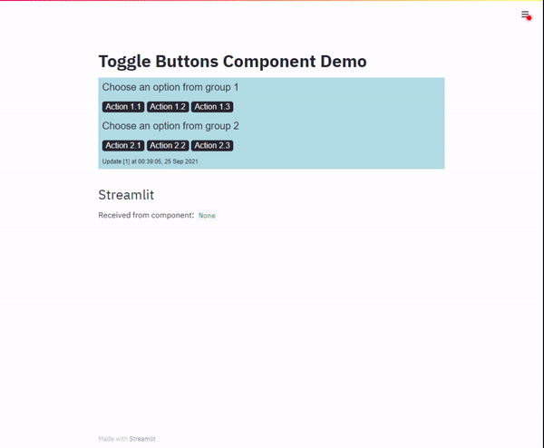
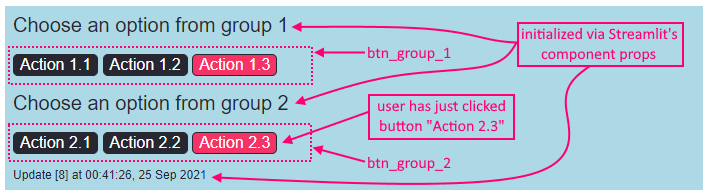

# Streamlit toggle buttons component

> Arvindra Sehmi, CloudOpti Ltd. | [Website](https://sehmiconscious.blogspot.com) | [LinkedIn](https://www.linkedin.com/in/asehmi/)

> Updated: 28 September, 2021

---

**TL;DR:** Implementation of toggle buttons as a pure static HTML/JS Streamlit component. The key learning from this
sample application is that the Streamlit app server and front end web server are not required to be separate. _The component implementation is in a plain HTML/JS file, which is loaded, executed and renderd directly from the Streamlit app server_.

## Demo



## Demo Multipage App

You can find a complete mini multipage app implementation in `./frontend_multipage_app`, which uses this simple framework. Run the app from the root folder:

```
$ streamlit run multipage_app.py
You can now view your Streamlit app in your browser.

  Local URL: http://localhost:8765
  Network URL: http://192.168.1.100:8765
```

## Overview

The component's front end implementation is in the `./frontend/` folder. There are two files here, `__init__.py` and `index.html`.

**`./frontend/__init__.py`**

This code (the presence of `__init__.py` makes it a Python module, actually) simply declares the component using Streamlit's `components.declare_component` API and exports a handle to it. This handle is `component_toggle_buttons`. You can see the `path` to the component is the same folder. When Streamlit loads the component it will serve the default `index.html` file from this location.

```python
import streamlit.components.v1 as components
component_toggle_buttons = components.declare_component(
    name='component_toggle_buttons',
    path='./frontend'
)
```

**`./frontend/index.html`**

This self-contained file does the following:

1. Draws a simple HTML user interface with styled buttons, in two class groups
2. Loads JavaScript which implements core Streamlit component life cycle actions, namely the ability to:
- Inform Streamlit client that the component is ready, using `streamlit:componentReady` message type.
- Calculate or get it's own visible screen height, and inform Streamlit client, using `streamlit:setFrameHeight` message type.
- Handle inbound `message` events from the Streamlit client; with `streamlit:render` event type being critical.
- Send values (i.e., objects) to the Streamlit client application, using `streamlit:setComponentValue` message type.

```html
<html>
<head>
  <style type="text/css">
  <!-- Removed for brevity -->
  </style>
</head>

<!--
----------------------------------------------------
Your custom static HTML goes in the body:
-->

<body>
  <h2 id="group_1_header">Awaiting value from Streamlit</h2>
  <input type="button" id="0" value="Action 1.1" class="btn_group_1 off" onclick="toggle(this, 'btn_group_1');">
  <input type="button" id="1" value="Action 1.2" class="btn_group_1 off" onclick="toggle(this, 'btn_group_1');">
  <input type="button" id="2" value="Action 1.3" class="btn_group_1 off" onclick="toggle(this, 'btn_group_1');">

  <h2 id="group_2_header">Awaiting value from Streamlit</h2>
  <input type="button" id="0" value="Action 2.1" class="btn_group_2 off" onclick="toggle(this, 'btn_group_2');">
  <input type="button" id="1" value="Action 2.2" class="btn_group_2 off" onclick="toggle(this, 'btn_group_2');">
  <input type="button" id="2" value="Action 2.3" class="btn_group_2 off" onclick="toggle(this, 'btn_group_2');">

  <div id="message_div">
    <br /><span id="message_label">Awaiting value from Streamlit</span>
  </div>
</body>

<script type="text/javascript">
  // ----------------------------------------------------
  // These functions should be used as is to perform required Streamlit 
  // component lifecycle actions:
  //
  // 1. Signal Streamlit client that component is ready
  // 2. Signal Streamlit client to set visible height of the component
  //    (this is optional, in case Streamlit doesn't correctly auto-set it)
  // 3. Pass values from component to Streamlit client
  //

  // Helper function to send type and data messages to Streamlit client

  const SET_COMPONENT_VALUE = "streamlit:setComponentValue"
  const RENDER = "streamlit:render"
  const COMPONENT_READY = "streamlit:componentReady"
  const SET_FRAME_HEIGHT = "streamlit:setFrameHeight"

  function _sendMessage(type, data) {
    // copy data into object
    var outboundData = Object.assign({
      isStreamlitMessage: true,
      type: type,
    }, data)

    if (type == SET_COMPONENT_VALUE) {
      console.log("_sendMessage data: " + JSON.stringify(data))
      console.log("_sendMessage outboundData: " + JSON.stringify(outboundData))
    }

    window.parent.postMessage(outboundData, "*")
  }

  function initialize(pipeline) {

    // Hook Streamlit's message events into a simple dispatcher of pipeline handlers
    window.addEventListener("message", (event) => {
      if (event.data.type == RENDER) {
        // The event.data.args dict holds any JSON-serializable value
        // sent from the Streamlit client. It is already deserialized.
        pipeline.forEach(handler => {
          handler(event.data.args)
        })
      }
    })

    _sendMessage(COMPONENT_READY, { apiVersion: 1 });

    // Component should be mounted by Streamlit in an iframe, so try to autoset the iframe height.
    window.addEventListener("load", () => {
      window.setTimeout(function () {
        setFrameHeight(document.documentElement.clientHeight)
      }, 0)
    })

    // Optionally, if auto-height computation fails, you can manually set it
    // (uncomment below)
    //setFrameHeight(200)
  }

  function setFrameHeight(height) {
    _sendMessage(SET_FRAME_HEIGHT, { height: height })
  }

  // The `data` argument can be any JSON-serializable value.
  function notifyHost(data) {
    _sendMessage(SET_COMPONENT_VALUE, data)
  }

  // ----------------------------------------------------
  // Your custom functionality for the component goes here:

  function toggle(button, group) {
    buttons = document.getElementsByClassName(group)
    console.log(buttons)
    for (let i = 0; i < buttons.length; i++) {
      console.log(buttons.item(i))
    }

    for (let i = 0; i < buttons.length; i++) {
      if (button.id == String(i) & button.className.includes("off")) {
        button.className = group + " on"
      } else if (button.id == String(i) & button.className.includes("on")) {
        button.className = group + " off"
      } else {
        buttons.item(i).className = group + " off"
      }
    }

    buttons = document.getElementsByClassName(group)
    actions = []
    for (let i = 0; i < buttons.length; i++) {
      btn = buttons.item(i)
      actions.push({ "action": btn.value, "value": btn.className.includes("on") })
    }

    states = {}
    states['choice'] = {
      "name": group,
      "state": {
        "action": button.value,
        "value": button.className.includes("on")
      }
    }
    states["options"] = { "name": group, "states": actions }

    notifyHost({
      value: states,
      dataType: "json",
    })
  }

  // ----------------------------------------------------
  // Here you can customize a pipeline of handlers for 
  // inbound properties from the Streamlit client app

  // Set initial value sent from Streamlit!
  function initializeProps_Handler(props) {
    let header1 = document.getElementById("group_1_header")
    header1.innerText = props.initial_state.group_1_header

    let header2 = document.getElementById("group_2_header")
    header2.innerText = props.initial_state.group_2_header
  }
  // Access values sent from Streamlit!
  function dataUpdate_Handler(props) {
    let msgLabel = document.getElementById("message_label")
    msgLabel.innerText = `Update [${props.counter}] at ${props.datetime}`
  }
  // Simply log received data dictionary
  function log_Handler(props) {
    console.log("Received from Streamlit: " + JSON.stringify(props))
  }

  let pipeline = [initializeProps_Handler, dataUpdate_Handler, log_Handler]

  // ----------------------------------------------------
  // Finally, initialize component passing in pipeline

  initialize(pipeline)

</script>

</html>
```

In this basic component, notice `_sendMessage()` function uses `window.parent.postMessage()`, which is as fundamental as it gets. The value objects you send to the Streamlit client application must be any JSON serializable object. Conceptually they can be viewed as data or events carrying a data payload. Inbound message values received on `streamlit:render` events, are automatically de-serialized to JavaScript objects.

It's only illustrative, but I have also implemented a simple pipeline of inbound message handlers and a dispatcher. I show this being used to initialize component data values, update the user interface, and to log output to the console. See `*_Handler()` functions, `pipeline`, `initialize()` function.

The counterpart to the front end is the Streamlit application. Its entry point is in `app.py`. The `frontend` module is imported and the component handle, `component_toggle_buttons`, is used to create an instance of it. Interactions in the front end which give rise to value notifications will be received in the Streamlit client, which can be acted upon as required. I've provided simple design abstractions to make running of the component and handling its return values more explicit. They are `run_component()` and `handle_event()` respectively. This _wrapping_ makes the implementation neater and it'll be conceptually easier to understand the implementation of more advanced components when you're ready to take the next step implementing React component front ends.

The HTML code for the toggle buttons groups a set of related buttons using a named class (my own convention). This group class name and the button instance is passed to the `onclick` handler, `toggle()`, which manages the styling for the `on/off` state, and
creates a JSON object to hold the button group's current state and the state of the clicked button. The button `id`s in each group are numbered from `0` upwards (again by my own convention). Finally, the JSON object is communicated to the Streamlit
client application using `notifyHost()`.

Here's a brief explantion of the user interface elements (pink is `on` and dark grey is `off`):



And below is an example of the JSON object sent to the Streamlit client, indicating that button `Action 2.3` in button group `btn_group_2` was clicked to the `on` state. In addition, the state of all buttons in the group `btn_group_2` is provided. Feel free to change the JSON payload schema to suit your own requirements.

```json
{
  "choice": {
    "name": "btn_group_2",
    "state": {
      "action": "Action 2.3",
      "value": true
    }
  },
  "options": {
    "name": "btn_group_2",
    "states": [
      {
        "action": "Action 2.1",
        "value": false
      },
      {
        "action": "Action 2.2",
        "value": false
      },
      {
        "action": "Action 2.3",
        "value": true
      }
    ]
  }
}
```

## Running the Toggle Buttons Component

The component is run in the same way as any Streamlit app.

- Open a console window and change directory to the root folder of the cloned GitHub repo, where `app.py` is.
- Now run the Streamlit server with this app.

```
$ streamlit run app.py
You can now view your Streamlit app in your browser.

  Local URL: http://localhost:8765
  Network URL: http://192.168.1.100:8765
```

- The app should start on the default port (8765) and launch a browser window to display the following page:

---

All code is published under [MIT license](./LICENSE), so feel free to make changes and please **fork the repo if you're making changes and submit pull requests**.

If you like this work, consider clicking that **star** button. Thanks!